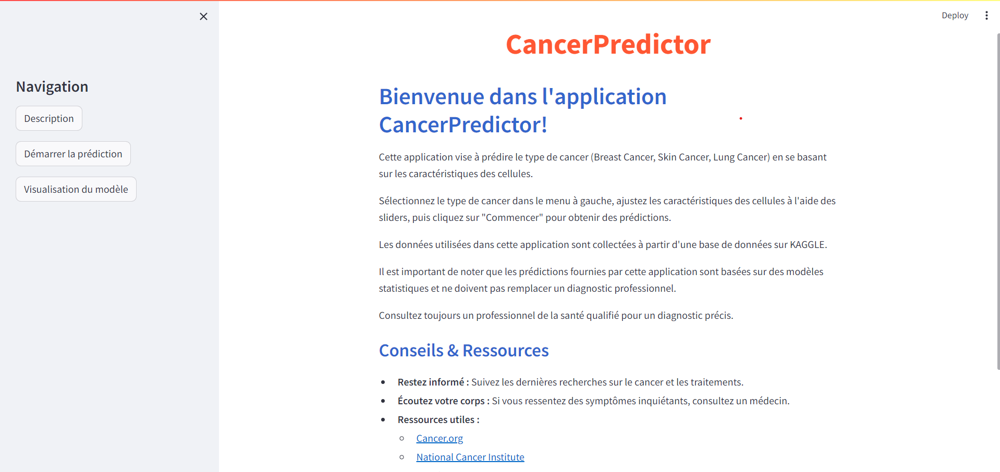
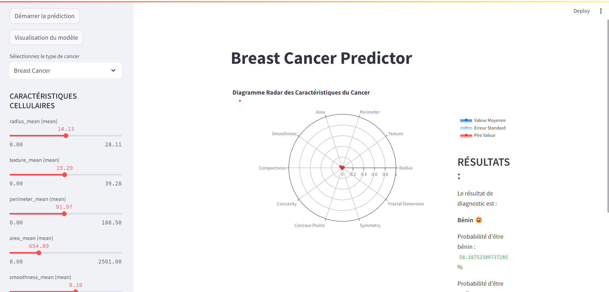
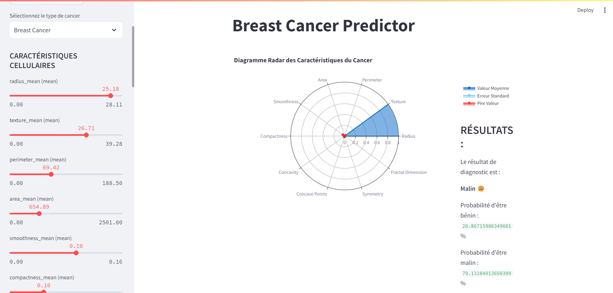
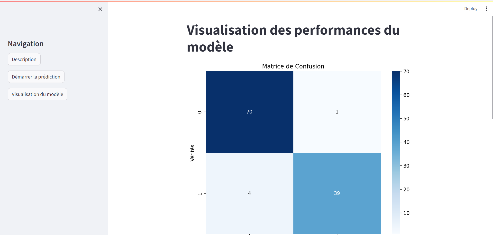
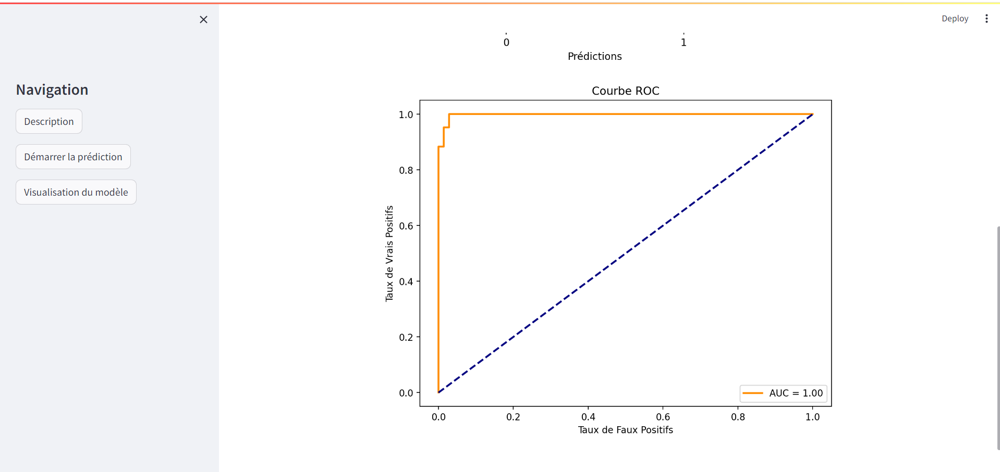

# CancerPredictor

## Overview
**CancerPredictor** is an interactive web application developed with **Streamlit** to predict the type of cancer (breast cancer, skin cancer, or lung cancer) based on cellular characteristics. The app utilizes machine learning models to deliver accurate predictions based on user input data.



## Features
- **Cancer Type Selection**: Choose between breast cancer, skin cancer, or lung cancer for prediction.
- **Prediction**: Input cellular characteristics using sliders to obtain a prediction on whether the cells are benign or malignant.
  
  
  
- **Visualization**: View results using radar charts, and evaluate model performance with ROC curves and confusion matrices.
  
  

## Technologies Used
- **Programming Language**: Python
- **Framework**: Streamlit
- **Libraries**:
  - Scikit-learn
  - Plotly
  - Pandas
  - NumPy
  - Matplotlib
  - Seaborn

## Installation

1. Clone the repository:
   ```bash
   git clone https://github.com/FayssalSabri/SmartCancerDetector.git
   cd SmartCancerDetector
   ```

2. Install the required dependencies:
   ```bash
   pip install -r requirements.txt
   ```

3. Run the application:
   ```bash
   streamlit run app.py
   ```

## How It Works
The application allows users to input features corresponding to three different types of cancers: breast, skin, and lung cancer. Based on the input, the machine learning model provides a prediction regarding the nature of the cancer (benign or malignant). Visualizations such as radar charts, ROC curves, and confusion matrices provide insights into model performance and prediction results.

## Models and Evaluation
CancerPredictor is powered by well-validated machine learning models trained on relevant datasets. The models have been evaluated using standard metrics like accuracy, precision, recall, and ROC-AUC to ensure reliable predictions. The confusion matrix and ROC curve visualizations allow users to assess the model's classification performance for each cancer type.

## Contributing
If you'd like to contribute to the project, feel free to fork the repository and submit a pull request. Any contributions such as adding new features, improving performance, or fixing bugs are welcome!

## License
This project is licensed under the MIT License. See the [LICENSE](LICENSE) file for more details.

## Contact
For any inquiries or questions, feel free to reach out to me:
- **Email**: fayssalsabri4@gmail.com
- **GitHub**: [FayssalSabri](https://github.com/FayssalSabri)
